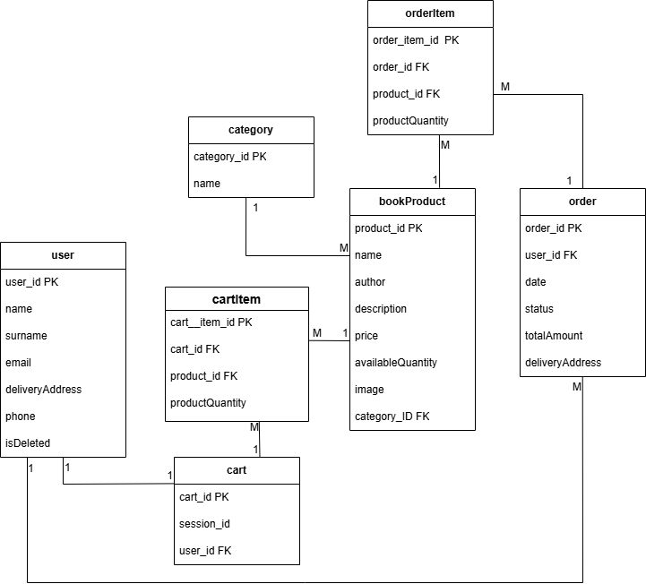

# Описание 
BookStore - книжный интернет-магазин.

## 🛠 Технологии
| Backend | Frontend |
|--------|----------|
| PostgreSQL | VanillaJS  | 
| Entity Framework | HTML/CSS |
| ASP.NET Core 8.0 |  |

# ER-диаграмма
На диаграмме представлена структура таблиц базы данных.

# API endpoints
## BookProduct 

| Method | Endpoint | Description | Swagger |
|--------|----------|-------------|---------|
| GET | `/` | Получение списка всех книжных продуктов | [📎 View](swagger/get_all_bookproducts.png) |
| GET | `/product/{id}` | Получение информации о продукте | |
| POST | `/` | Добавление нового книжного продукта | |
| PUT | `/products/{id}` | Изменение продукта | |
| DELETE | `/products/{id}` | Удаление продукта | |

## User 

| Method | Endpoint | Description |
|--------|----------|-------------|
| GET | `/user/all` | Получение списка пользователей |
| GET | `/user/{id}` | Информация о пользователе |
| GET | `/user/{id}/orders` | Получение заказов пользователя |
| GET | `/user/{id}/cart` | Получение корзины пользователя |
| GET | `/user/check-phone/{phone}` | Проверка на авторизацию по номеру телефона |
| POST | `/user/register` | Регистрация нового пользователя |
| PUT | `/user/{id}` | Изменение данных пользователя |
| DELETE | `/user/{id}` | Удаление пользователя |

## Cart 

| Method | Endpoint | Description |
|--------|----------|-------------|
| GET | `/cart/all` | Получение списка всех корзин |
| GET | `/cart/{id}` | Получение содержимого корзины |
| GET | `/cart/{id}/item/{itemid}` | Получение информации об одном элементе корзины |
| GET | `/cart/user/{userId}` | Получение ID корзины по ID пользователя |
| GET | `/cart/session/{sessionId}` | Получение ID корзины по сессионному ID |
| POST | `/cart/{id}/item` | Добавление продукта в корзину по ID пользователя/сессии |
| POST | `/cart/create/{sessionId}` | Создание сессионной корзины |
| PUT | `/cart/item/update/{cartItemId}` | Изменение количества товара |
| DELETE | `/cart/{id}/item/{itemid}` | Удаление продукта из корзины по ID пользователя/сессии |
| DELETE | `/cart/{id}` | Удаление содержимого корзины |
| DELETE | `/cart/session/{id}` | Удаление сессионной корзины |

## Category

| Method | Endpoint | Description |
|--------|----------|-------------|
| GET | `/categories` | Получение списка всех категорий |
| GET | `/categories/{id}` | Получение продуктов по категории |
| POST | `/categories` | Добавление новой категории |
| PUT | `/categories/{id}` | Изменение категории |
| DELETE | `/categories/{id}` | Удаление категории |

## Order 

| Method | Endpoint | Description |
|--------|----------|-------------|
| GET | `/order/all` | Получение списка всех заказов |
| GET | `/order/{id}` | Получение заказа по ID |
| GET | `/order/{id}/item/{itemid}` | Получение информации о продукте из заказа |
| POST | `/order` | Создание нового заказа |
| PUT | `/order/{id}` | Изменение заказа |
| DELETE | `/order/{id}` | Удаление заказа |

## Swagger
  `/swagger`

# BookStore
📌 **Главная страница**: `/bookstore.html`

📌 **Личный кабинет**: `/auth.html`

📌 **Корзина**: `/cart.html`
  
📌 **Категории**: `/categories.html`

📌 **Заказы**: `/orders.html`

📌 **Страница продукта**: `/product-info.html`